# Caching Strategies: Read, Write, and Invalidation Patterns

In distributed systems, caching is one of the most effective ways to improve performance and reduce load on your primary database. However, introducing a cache introduces the problem of **data consistency**. Choosing the right strategy for reading from and writing to the cache is critical to balancing latency, consistency, and complexity.

This article explores the five most common caching strategies: **Cache-Aside**, **Read-Through**, **Write-Through**, **Write-Back**, and **Write-Around**.

---

## 1. Cache-Aside (Lazy Loading)

This is the most common caching strategy. The application code (not the cache itself) is responsible for orchestrating the data flow between the cache and the database.

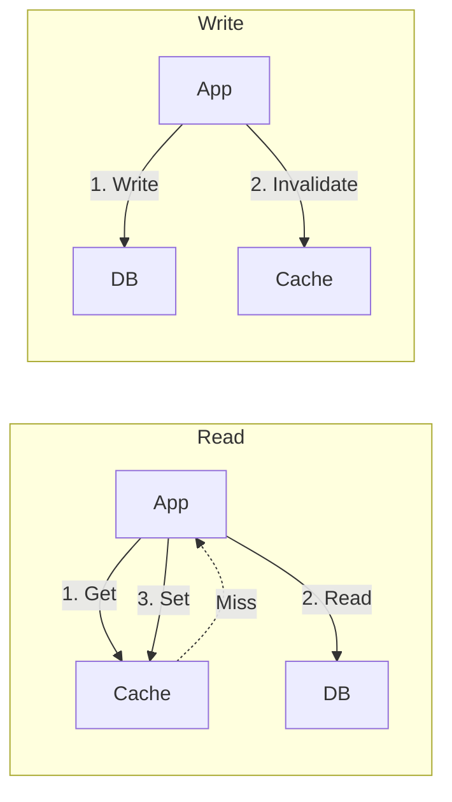

### Mechanism
1.  **Read**: The application checks the cache for the key.
    *   **Hit**: Return data.
    *   **Miss**: The application reads from the database, writes the value to the cache, and then returns the data.
2.  **Write**: The application writes data directly to the database.
    *   **Invalidation**: Immediately after the DB write, the application **deletes** (invalidates) the corresponding key in the cache.

### Pros
*   **Resilience**: If the cache fails, the system can still operate by going directly to the database (though performance will degrade).
*   **Cost Effective**: Data is only cached when it is actually requested ("lazy" loading). You don't fill your cache with data that is never read.
*   **Control**: The logic is in your application, making it easy to debug and modify.

### Cons / Pitfalls
#### Staleness 
There is a small window of inconsistency. If a write happens to the DB, but the cache invalidation fails, the cache will hold stale data until the TTL (Time To Live) expires.

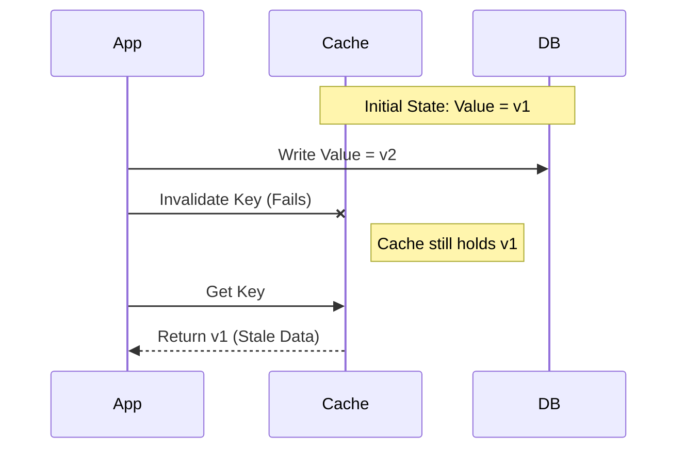

**Mitigation**
*   **TTL (Time-To-Live)**: Set key expiration as a safety net for failed invalidations. Shorter TTLs reduce staleness but increase cache misses.
*   **Retry Queue**: If the cache invalidation command fails, push the key to a message queue to retry the invalidation asynchronously until it succeeds. However, watch out for permanent failures causing infinite retry loops. Implement a retry limit or Dead Letter Queue (DLQ) to handle these cases.
*   **Change Data Capture (CDC)**: Use a separate process to monitor database transaction logs (binlogs) and invalidate cache entries. This decouples cache consistency from the application flow.

    ```mermaid
    graph LR
        App -->|Write| DB
        DB -- reads log --> CDC["CDC Service"]
        CDC -->|Invalidate| Cache
    ```
    


#### Thundering Herd: 

On a cache miss (or startup), many requests might hit the database simultaneously for the same key before the cache is populated.

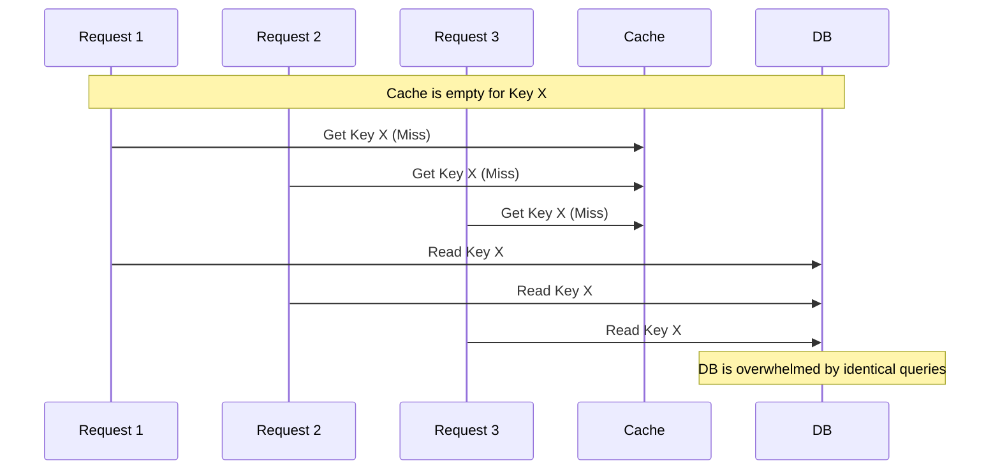

**Mitigation**:
*   **Cache Warming**: Pre-load the cache with frequently accessed data before a service instance goes live. This can be done via a post-deployment script that loads top items, or a scheduled job that periodically refreshes popular keys.
*   **Request Coalescing (Locking)**: On a cache miss, only allow the *first* request to go to the database to fetch the data. Other concurrent requests for the same key wait for a short period. Once the first request populates the cache, the waiting requests can be served directly from the cache.


#### Complexity 
The application code must explicitly manage the cache. As the mitigations for staleness and thundering herds demonstrate, this responsibility can introduce significant complexity.


### Best Use Case
*   **General Purpose / Read-Heavy Workloads**: This is a versatile default choice. It excels in applications where data is read far more often than it is written (e.g., user profiles, product details, blog posts). The lazy-loading approach ensures that only frequently requested data occupies cache memory, while the application-level control makes it relatively simple to implement and reason about.
*   **Unpredictable Access Patterns**: Because data is loaded only when first requested (lazy loading), this strategy is highly memory-efficient when access patterns are random or unknown. It avoids filling the cache with data that might never be read, ensuring memory is used only for items that have demonstrated demand.

---

## 2. Read-Through

In this strategy, the cache sits inline between the application and the database. The application treats the cache as the main data store and does not interact with the database directly for reads.

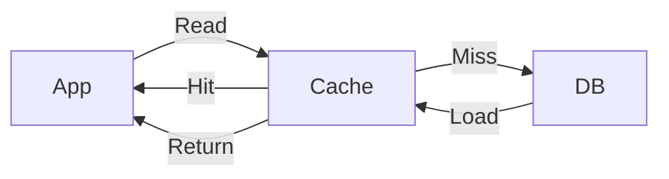

### Mechanism
1.  The application requests data from the cache.
2.  **Hit**: The cache returns the data.
3.  **Miss**: The **cache provider** (or library) automatically connects to the database, fetches the data, updates the cache, and returns it to the application.

### Pros
*   **Simplicity**: The application code is cleaner; it only deals with the cache API.
*   **DRY (Don't Repeat Yourself)**: The logic for fetching data is centralized in the cache provider/loader, not scattered across the app.

### Cons / Pitfalls
#### First-Hit Latency (Thundering Herd)
Just like Cache-Aside, the first request for a given key will always be a miss. The cache must then block while it fetches the data from the database. If many requests for the same missing key arrive simultaneously, the cache provider might send multiple identical queries to the database, causing a thundering herd.

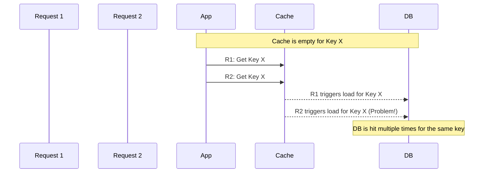

**Mitigation**:
*   **Cache Warming**: Pre-load the cache with common items before the application starts serving traffic.
*   **Provider-Level Locking**: A sophisticated cache provider will implement an internal lock, ensuring that for a given missing key, only the first request triggers a database load. Subsequent requests wait for the first one to complete and populate the cache.

#### Implementation Complexity & Coupling
The abstraction that makes Read-Through simple for the application developer comes at a cost. The cache provider itself becomes more complex. You must implement a custom "loader" or "reader" component that contains the logic for connecting to and querying the database. This tightly couples the caching layer to the data source, making it harder to change the database schema or switch database technologies without also modifying the cache loader configuration.

### Best Use Case
*   **Read-Heavy Workloads with Standardized Data Access**: Ideal for applications where data is read frequently and the logic for fetching it is consistent. By centralizing the data-loading logic in the cache provider, you avoid repeating the "check cache, then DB" pattern throughout your application, leading to cleaner, DRYer code.
*   **Accelerating Legacy Systems**: Read-Through is an excellent way to introduce caching to an existing application with minimal code changes. You can often replace the existing data access client with a caching client that uses the same interface, transparently adding a performance layer without a major refactor.

---

## 3. Write-Through

This strategy is often paired with Read-Through. The application writes to the cache, and the cache synchronously writes to the database.

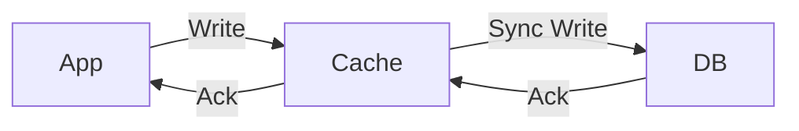

### Mechanism
1.  The application writes data to the cache.
2.  The cache updates its local store.
3.  The cache synchronously writes the data to the database.
4.  The write is confirmed only after **both** the cache and DB are updated.

### Pros
*   **Data Consistency**: The cache and database are almost always in sync.
*   **Read Performance**: Data is updated in the cache immediately, so subsequent reads are fast and never stale.
*   **Reliability**: Since the DB write is synchronous, you know the data is persisted.

### Cons / Pitfalls
#### High Write Latency
The primary drawback is increased latency on write operations. The application must wait for two network round-trips (one to the cache, one to the database) to complete before it receives a confirmation. This makes it unsuitable for write-heavy applications where low latency is critical.

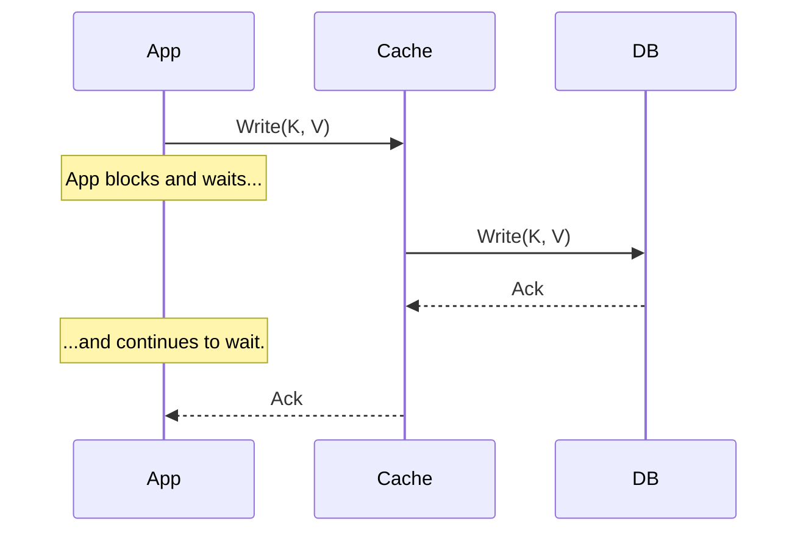

#### Cache Pollution
This strategy writes data to the cache regardless of its future read frequency. If an application writes a lot of data that is rarely or never read again, the cache can become filled with "cold" data, evicting more useful, "hot" data. This is why it's often combined with a thoughtful TTL or eviction policy.

### Best Use Case
*   **Systems Requiring Strong Consistency**: This is the go-to pattern when the application cannot tolerate any data discrepancy between the cache and the database. It's ideal for critical systems like banking applications or e-commerce inventory management, where serving stale data could have significant consequences.
*   **Data That Is Read Immediately After Write**: It's highly effective for data that becomes "hot" as soon as it's created or updated. For example, a user's new social media post, a comment, or a top score on a leaderboard will be written once and then read many times. Writing it directly to the cache ensures all subsequent reads are fast cache hits.

---

## 4. Write-Back (Write-Behind)

This is a performance-oriented strategy where the application writes to the cache, and the cache acknowledges the write immediately. The cache then writes the data to the database asynchronously at a later time.

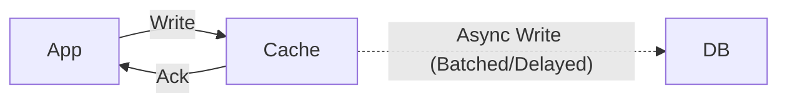

### Mechanism
1.  The application writes data to the cache.
2.  The cache updates its store and immediately acknowledges the write to the application.
3.  The cache asynchronously syncs the data to the database (e.g., after a delay or in batches).

### Pros
*   **High Write Performance**: Extremely low latency for the application since it doesn't wait for the database.
*   **Database Load Reduction**: The cache can coalesce multiple writes to the same key into a single database update, or batch multiple records into one transaction.

### Cons / Pitfalls
*   **Data Loss Risk**: If the cache crashes before it flushes data to the database, that data is lost forever.
*   **Complexity**: Implementing a reliable write-behind queue and handling failure scenarios (e.g., DB is down) is difficult.

#### Data Loss Risk
This is the most significant drawback. Because the application receives an acknowledgment before the data is persisted to the database, any failure of the cache node(s) can lead to permanent data loss. The data exists only in the volatile memory of the cache until it is successfully written to the database.

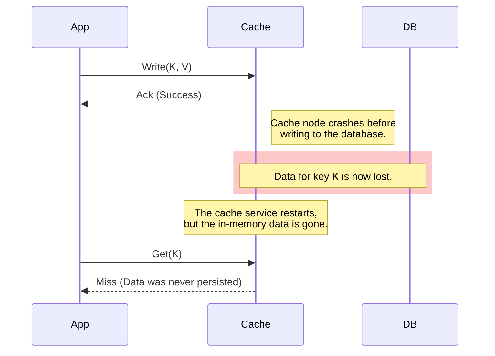

**Mitigation**:
*   **Persistent Queues**: Instead of an in-memory queue, the cache can write pending changes to a durable message queue (like Kafka, RabbitMQ) or a log file on disk. This ensures that even if the cache process restarts, it can resume writing the pending changes.
*   **Cache Replication**: Using a clustered cache where writes are replicated to one or more other cache nodes can reduce the risk of a single-node failure causing data loss. However, this adds complexity and doesn't protect against a full cluster outage.

#### Complexity & Inconsistency
The system is eventually consistent, but the window of inconsistency is unpredictable and can be large, especially if the database is slow or unavailable. Implementing a robust Write-Back system is complex. You need to manage:
*   **Batching/Coalescing Logic**: Deciding when and how to group writes.
*   **Retry Mechanisms**: Handling transient database failures.
*   **Failure Queues (DLQ)**: What to do with writes that permanently fail.
*   **Monitoring**: Observing the queue length to detect issues with the write-behind process.

### Best Use Case
*   **Write-Heavy Applications**: Ideal for systems that need to absorb a massive volume of writes with very low latency. Examples include IoT sensor data ingestion, real-time bidding platforms, user activity tracking (clicks, views), and gaming leaderboards. The application can move on immediately after the write, and the cache buffers the load on the database.
*   **Systems with Transient Data**: Effective for data where a small amount of loss is acceptable in exchange for a huge performance gain. For example, if you are collecting millions of analytics events per minute, losing a few seconds' worth of data in a crash might be an acceptable trade-off for keeping the system responsive.

---

## 5. Write-Around

This strategy is a variation of Cache-Aside, specifically designed to prevent the cache from being filled with data that is unlikely to be read again soon.

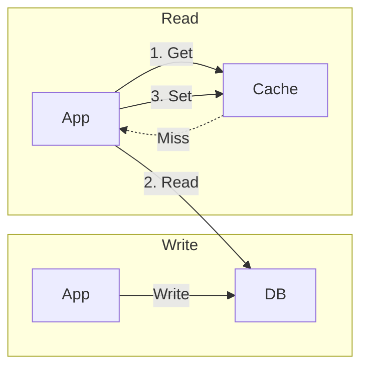

### Mechanism
1.  **Write**: The application writes directly to the database, **bypassing** the cache.
2.  **Read**: The application reads from the cache.
    *   **Miss**: The application reads from the DB and updates the cache (standard Cache-Aside).

### Pros
*   **Cache Efficiency**: Prevents the cache from being flooded with data that is written once and rarely read (e.g., logs, archival data).
*   **Performance**: Reduces write latency compared to Write-Through since the cache isn't involved in the write path.

### Cons / Pitfalls
*   **Read Miss**: If the data is written and then immediately requested, it will result in a cache miss, requiring a read from the DB to populate the cache.

#### Read Latency on New Data
The primary trade-off is that the first read of any newly written data will always be a cache miss. This results in higher latency for that initial read, as the application must perform two operations: a database read followed by a cache write. This can be problematic for "read-after-write" access patterns.

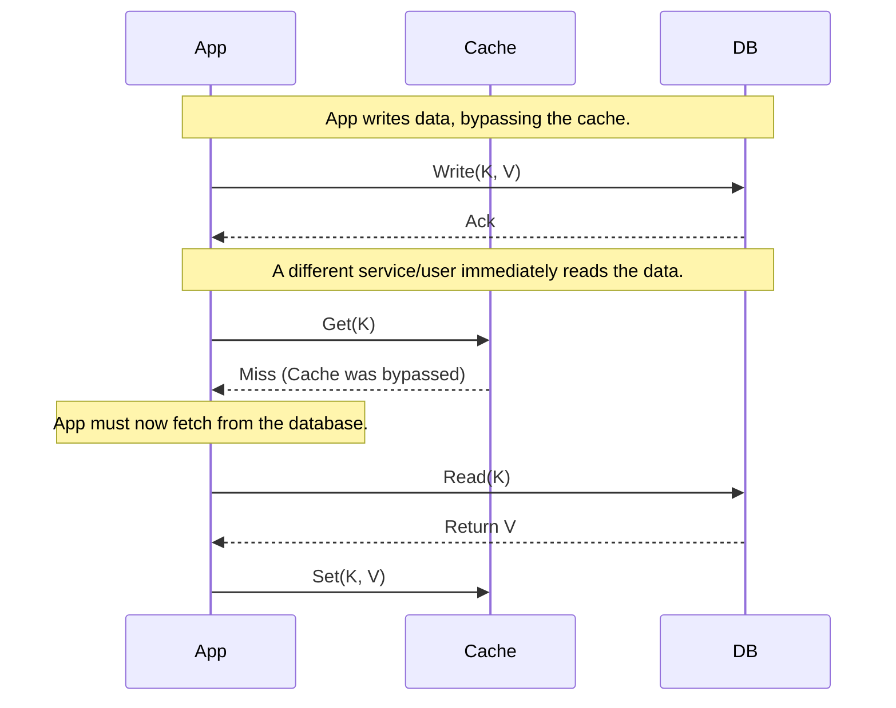

### Best Use Case
*   **"Write Once, Read Rarely" Workloads**: This is the perfect pattern for data that is written but not expected to be read immediately or frequently. Common examples include application logging, storing historical transaction records, or archiving user data. It ensures that these bulk writes do not evict more valuable, "hot" data from the cache.
*   **Separating Batch and Real-Time Workloads**: When a batch processing job updates large amounts of data in the primary database, you don't want it to flood the cache that your real-time application relies on. Using Write-Around for the batch job ensures the cache's integrity and performance for the user-facing application.

---

## Summary Comparison

| Strategy | Read Flow | Write Flow | Consistency | Write Speed | Best For |
| :--- | :--- | :--- | :--- | :--- | :--- |
| **Cache-Aside** | App -> Cache -> DB | App -> DB (Invalidate Cache) | Eventual | Fast | General purpose, Read-heavy |
| **Read-Through** | App -> Cache (-> DB) | N/A (usually paired with Write-Through) | High | N/A | Transparent caching, Legacy apps |
| **Write-Through** | N/A | App -> Cache -> DB | Strong | Slow | Critical consistency |
| **Write-Back** | N/A | App -> Cache (-> Async DB) | Eventual (Risk of loss) | Very Fast | High-volume writes, Analytics |
| **Write-Around** | App -> Cache -> DB | App -> DB (Skip Cache) | Eventual | Fast | Archival data, Logs |
