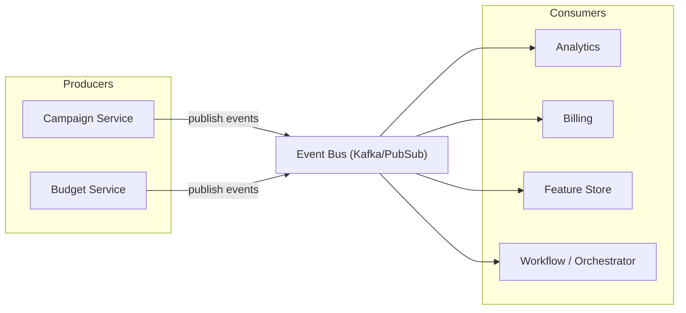
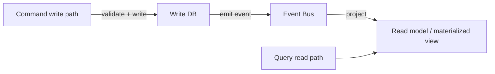
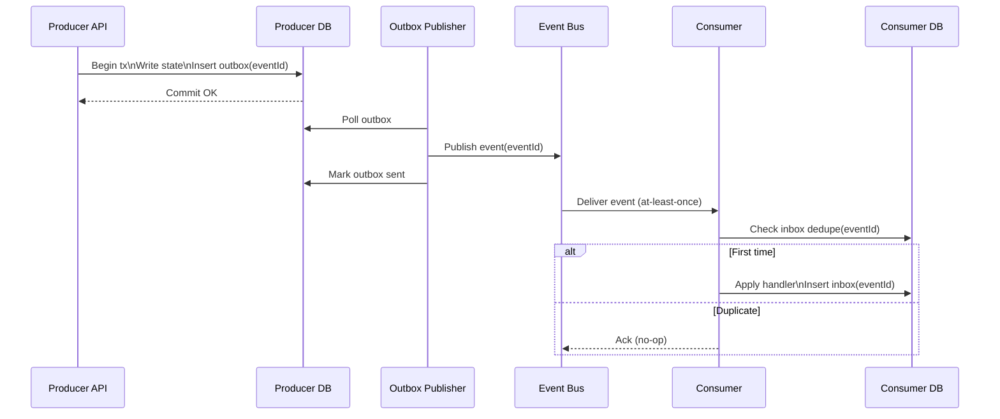
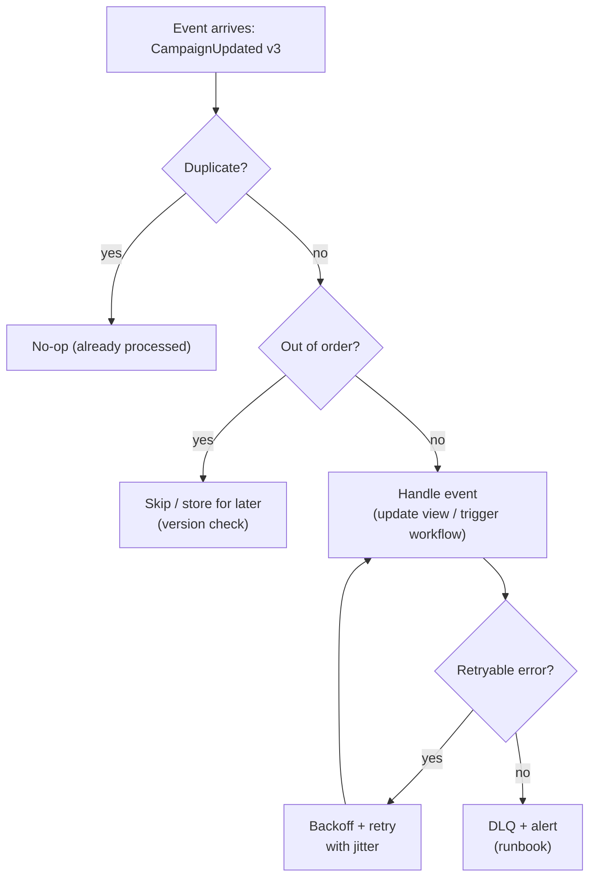

### Event-driven architecture patterns

Event-driven architecture (EDA) is the most common way to scale distributed systems without turning every change into a cross-team synchronous dependency. Instead of one service calling ten other services in-line, a service publishes an event (“something happened”), and downstream consumers react asynchronously.

In production, EDA succeeds when you treat it as an operational model, not just an integration pattern. The system must remain correct under:

- retries (at-least-once delivery)
- reordering (out-of-order events)
- partial outages (consumer lag, delayed projections)
- schema evolution (multiple versions in-flight)

Done well, EDA reduces coupling and increases throughput. Done poorly, it becomes “distributed spaghetti” where debugging feels impossible.

---

#### What an event is (and what it isn’t)

An **event** is an immutable record that *a fact occurred* at a point in time.

- Good: `CampaignActivated`, `BudgetReserved`, `ImpressionRecorded`
- Risky: `RecalculatePacingNow` (this is a command), `UpdateCampaign` (this is a request)

Practical guideline: keep the event name in past tense and design it to be meaningful even years later during an audit or backfill.

---

#### The basic topology: producers, bus, consumers

At scale, the value proposition is fan-out: one producer change triggers many downstream updates without synchronous coupling.

What makes this operable:

- clear ownership (who publishes what; who consumes what)
- stable contracts (schemas, versioning)
- replay safety (idempotent consumers)
- observability (correlation IDs, event IDs, lag metrics)

---

#### CQRS in practice (why it’s so common)

CQRS (command-query responsibility segregation) is a pattern where writes and reads have different models.

- **Write path**: validates business rules and commits source-of-truth state.
- **Read path**: serves queries from a materialized view optimized for reads.

EDA often provides the glue: write commits emit events; consumers project read models.

Production lessons:

- Treat the read model as **derived**. You must be able to rebuild it.
- If the read model is stale, degrade gracefully (show last-updated timestamps, serve from source of truth for critical queries).
- Lag becomes a first-class SLO, not a hidden implementation detail.

---

#### Event sourcing (use it deliberately)

Event sourcing is the extreme form of “events are truth”: state is derived by replaying an event log. This can be powerful when you need auditability, time travel, or complex business invariants. It can also impose serious operational and product constraints.

Practical guidance:

- Prefer event sourcing for domains that naturally behave like ledgers (money movement, immutable audit trails).
- Be cautious for high-churn CRUD domains where “current state” is the product and historical reconstruction doesn’t add much value.

Many teams get 80% of the benefit with a simpler approach: store authoritative state in a DB, publish events via outbox, and keep an append-only audit log for critical facts.

---

#### Reliability: outbox + inbox is your seatbelt

The most common EDA production bug is the “dual write” problem:

- You commit DB state, then try to publish an event
- One succeeds and the other fails

Use the **outbox pattern** to make publishing consistent with local commits, and the **inbox pattern** for consumer dedupe.

If you adopt only one “advanced” EDA practice, make it this one.

---

#### Idempotency, ordering, and retries (the real daily work)

At-least-once delivery means you will process duplicates. Distributed delivery means you will see reordering. Production systems handle this with a few consistent techniques:

- **Idempotent handlers**: safe to run twice.
- **Dedupe keys**: store processed event IDs or derived idempotency keys.
- **Monotonic versioning**: apply only if event version is newer than what you have.
- **Retry policy**: transient vs permanent errors.
- **DLQ with runbooks**: don’t block entire partitions forever.

Practical caution: retries can become your biggest hidden producer. Monitor retry rate and implement retry budgets; otherwise, an outage turns into a self-inflicted DDoS.

---

#### Workflows: events vs orchestration

Events can trigger workflows (e.g., “campaign toggled active → recompute pacing”). There are two approaches:

- **Choreography**: services react to events and emit more events.
- **Orchestration**: a coordinator owns a state machine and drives steps.

Choreography is easy to start with and scales fan-out well. Orchestration is often easier to operate for multi-step business transactions because there is one place to see state and reason about compensations.

---

#### Schema evolution: treat it as a product

Schema evolution is where EDA systems often break during growth.

Rules that keep teams out of trouble:

- Use explicit versions (or compatibility rules) and enforce them in CI.
- Prefer backward-compatible changes (additive fields, optional fields).
- Don’t assume all consumers deploy at the same time.
- Provide a deprecation window and measure remaining old-version traffic.

If you can, use a schema registry and run automated compatibility checks on every change.

---

#### Observability: debugging across services is the tax you must pay

EDA shifts complexity from code flow to system flow. You need consistent identifiers:

- `eventId` (unique per event)
- `correlationId` / `traceId` (ties a chain of events to a user action)
- `entityId` (campaignId, orderId)

Minimum dashboards that save you during incidents:

- consumer lag / time-in-queue by group/topic
- publish failures (outbox backlog)
- DLQ volume and age
- handler latency and error rate

---

#### Design trade-offs (what you’re choosing)

- **Loose coupling vs immediate consistency**: you gain independence, but clients must tolerate stale views.
- **Fan-out power vs debugging cost**: you gain extensibility, but tracing becomes mandatory.
- **Operational simplicity vs flexibility**: the more ad-hoc consumers you allow, the harder governance becomes.

---

#### A short checklist

- Define event contracts and ownership (producer is responsible for correctness).
- Use outbox for publishing and inbox/dedupe for consumers.
- Make handlers idempotent and safe under retries.
- Decide ordering strategy (per-key partitioning, version checks, or reconciliation).
- Set SLOs for lag and time-in-queue; alert on violations.
- Invest early in tracing with eventId + correlationId.
- Treat schema evolution as a first-class workflow (compat checks + deprecation).

